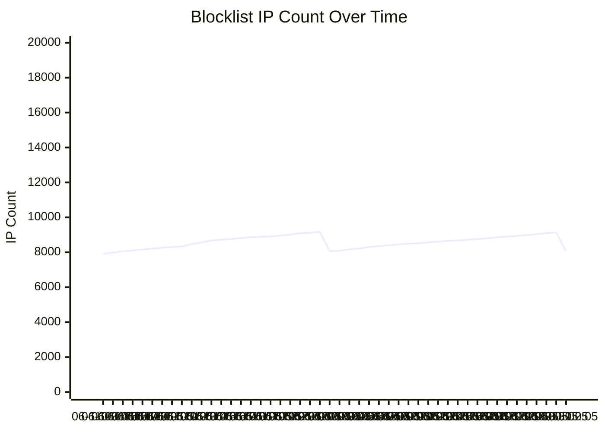

# 🍯 Blocklist – Fresh From the Honeypot

---

## What is this?

An automatically updated list of IP addresses that apparently have nothing better to do than attack my honeypot.

These addresses have voluntarily – and with impressive consistency – decided to attack a server that **exists solely to be attacked**. Congratulations. 🎉

---

## How does it work?

```
Attacker:   "I'm gonna hack this server!"
Honeypot:   *notes down IP address*
Attacker:   *feels like a hacker*
Honeypot:   "Thank you for your submission. Have a lovely day."
```

This list is automatically updated every 60 minutes. The entries come from an Elasticsearch server that diligently logs all connection attempts from the past 7 days. Somewhere out there, a Russian port scanner is unknowingly contributing to an open-source project.

---

## What do I do with this list?

I block all these IPs on my production servers via nginx. But the list is also perfect for use in firewall solutions like **pfSense** or **OPNsense** – see below.

---

## Files

| File | Contents |
|---|---|
| `attacker_ips.txt` | The Hall of Shame – updated fresh daily |

---

## Using this list in pfSense

pfSense can automatically fetch and block IP lists using the **pfBlockerNG** package.

**1. Install pfBlockerNG**
Navigate to `System → Package Manager → Available Packages`, search for `pfBlockerNG` and install it.

**2. Add a new IP feed**
Go to `Firewall → pfBlockerNG → IP → IPv4` and click **Add**.

**3. Configure the feed**

| Field | Value |
|---|---|
| Name | `HoneypotBlocklist` |
| Description | `Fresh honeypot attacker IPs` |
| Source URL | `https://raw.githubusercontent.com/cercatrova21/blocklist/main/attacker_ips.txt` |
| Format | `Auto` |
| Action | `Deny Both` (or `Deny Inbound`) |

**4. Apply**
Go to `Firewall → pfBlockerNG → Update` and run a forced update. The IPs will now be blocked automatically and refreshed on your chosen schedule.

---

## Using this list in OPNsense

OPNsense handles IP blocklists natively through its built-in **Alias** and **Firewall Rule** system – no extra package needed.

**1. Create an Alias**
Go to `Firewall → Aliases` and click **+Add**.

| Field | Value |
|---|---|
| Name | `HoneypotBlocklist` |
| Type | `URL Table (IPs)` |
| URL | `https://raw.githubusercontent.com/cercatrova21/blocklist/main/attacker_ips.txt` |
| Refresh Interval | `1` (in days, or set to your preference) |
| Description | `Fresh honeypot attacker IPs` |

Click **Save** and then **Apply**.

**2. Create a Firewall Rule**
Go to `Firewall → Rules → WAN` and click **+Add**.

| Field | Value |
|---|---|
| Action | `Block` |
| Interface | `WAN` |
| Source | `HoneypotBlocklist` |
| Description | `Block honeypot attacker IPs` |

Click **Save** and **Apply Changes**. OPNsense will now automatically fetch the latest list and block all listed IPs at the firewall level.

---

## Frequently Asked Questions

**Is my IP in here?**
If you're asking, probably not. If you're *not* asking but still want to know: `grep "your.ip.here" attacker_ips.txt`

**Can I use this list?**
Please do. The more people block these IPs, the more frustrated the operators of these port scanners will be. That's the whole point.

**Are real humans being blocked?**
Possibly. But anyone with a legitimate reason to scan my honeypot is welcome to get in touch.

**How often is the list updated?**
Every 60 minutes. The attackers never sleep, so neither does the cronjob.

---

## IP Count Over Time

<!-- CHART_START -->


> **Current count:** 8055 IPs \&nbsp;|\&nbsp; **Tracking since:** 2026-06-11 03:05 \&nbsp;|\&nbsp; **Change (period):** +147
<!-- CHART_END -->

---

## Statistics (roughly)

- 🇨🇳 China: *Yes*
- 🇷🇺 Russia: *Also yes*
- 🇺🇸 USA (various VPS providers): *Surprisingly also yes*
- 🏠 My neighbour: *Hopefully no*

---

## Legal

This list contains exclusively IPs that have **actively attempted** to break into my systems. If you want your IP removed, stop attacking honeypots.

---

*Automatically updated by a bash script that works harder than most people.*
